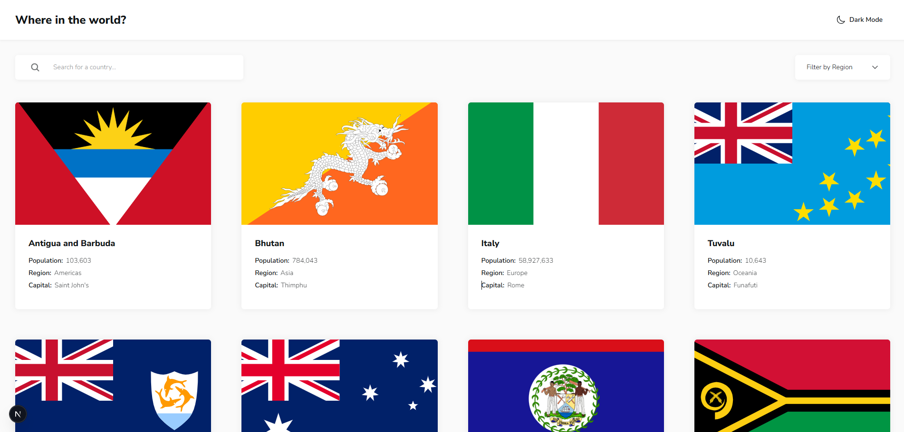

# Frontend Mentor - REST Countries API with color theme switcher solution

This is a solution to the [REST Countries API with color theme switcher challenge on Frontend Mentor](https://www.frontendmentor.io/challenges/rest-countries-api-with-color-theme-switcher-5cacc469fec04111f7b848ca). Frontend Mentor challenges help you improve your coding skills by building realistic projects.

## Table of contents

- [Overview](#overview)
  - [The challenge](#the-challenge)
  - [Screenshot](#screenshot)
  - [Links](#links)
- [My process](#my-process)
  - [Built with](#built-with)
  - [What I learned](#what-i-learned)
- [Author](#author)

## Overview

### The challenge

Users should be able to:

- See all countries from the API on the homepage
- Search for a country using an `input` field
- Filter countries by region
- Click on a country to see more detailed information on a separate page
- Click through to the border countries on the detail page
- Toggle the color scheme between light and dark mode _(optional)_

### Screenshot

### Links

- Solution URL: [https://github.com/nahuelcaputto/rest-countries-api](https://github.com/nahuelcaputto/rest-countries-api)
- Live Site URL: [https://rest-countries-api-psi-pied.vercel.app/](https://rest-countries-api-psi-pied.vercel.app/)

## My process

### Built with

- Semantic HTML5 markup
- CSS custom properties
- Flexbox
- CSS Grid
- Mobile-first workflow
- [React](https://reactjs.org/) - JS library
- [Next.js](https://nextjs.org/) - Frontend build tool
- [REST Countries API](https://restcountries.com/) - Country data source
- [Tailwind CSS](https://tailwindcss.com/) - Utility-first CSS framework

### What I learned

This project allowed me to deepen my understanding of **Next.js**, particularly its file-based routing system, page structure, and the benefits of using a framework optimized for performance and scalability.

By working with the **REST Countries API**, I gained hands-on experience consuming external APIs, handling asynchronous data fetching, and transforming complex JSON responses into clean, user-friendly UI components.

I also reinforced my knowledge of **React**, focusing on component composition, state management, and rendering dynamic lists based on API data.

Finally, I continued to strengthen my use of **Tailwind CSS**, applying a mobile-first approach and building responsive layouts efficiently using utility-first classes.

## Author

- Github - [Nahuel Caputto](https://github.com/nahuelcaputto)
- Frontend Mentor - [@nahuelcaputto](https://www.frontendmentor.io/profile/nahuelcaputto)
- LinkedIn - [@nahuel-caputto](https://www.linkedin.com/in/nahuel-caputto/)
